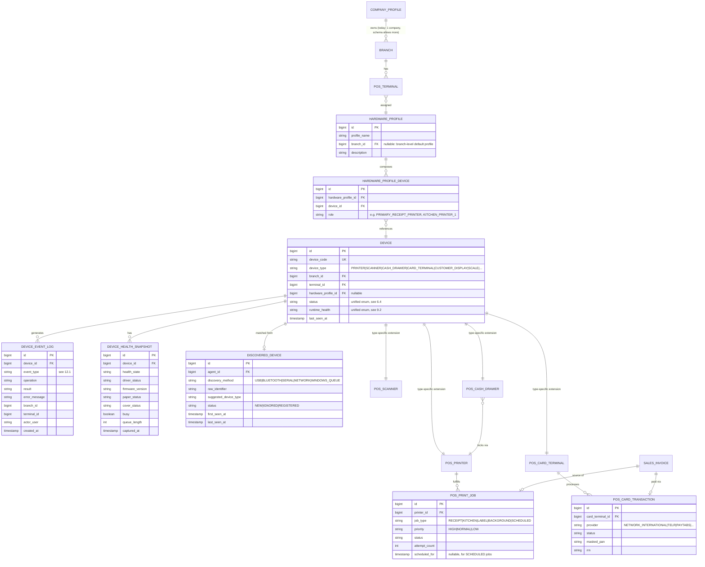
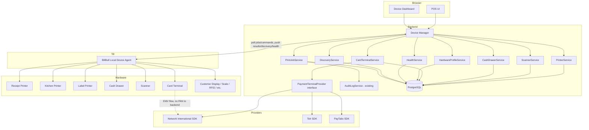
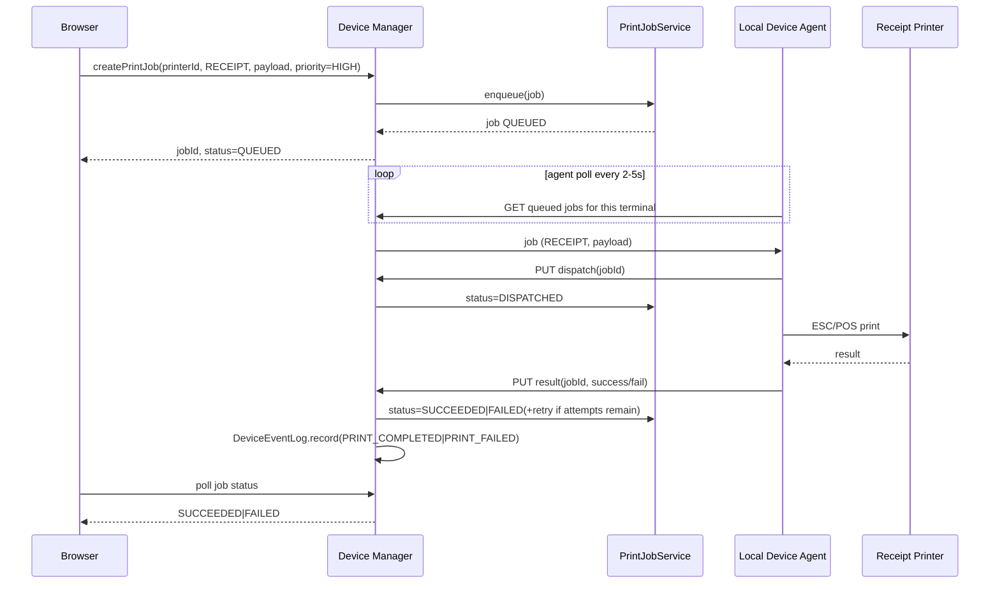
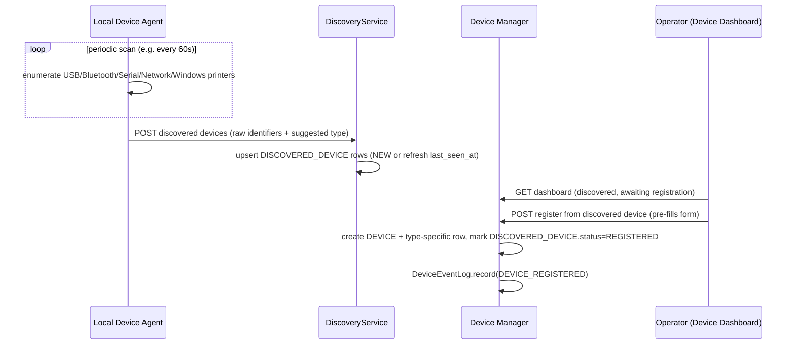
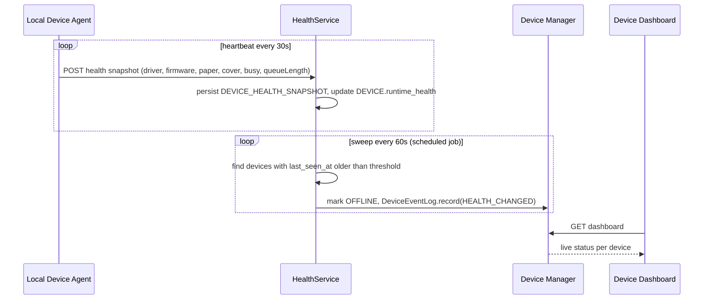
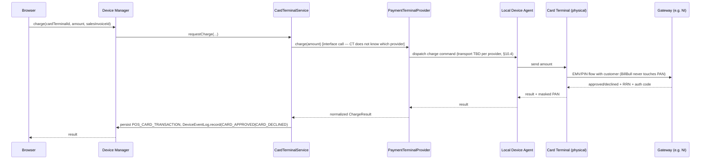
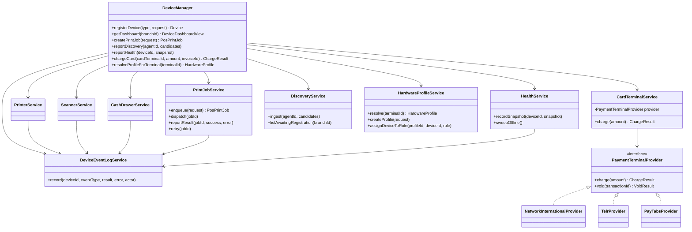

# BillBull POS Device Management — Enterprise Architecture Specification (v2)

**Status: DESIGN PHASE. No production code, no migrations, no source file changes accompany this document.**
Supersedes the device-architecture direction in [pos-device-architecture-research-2026-06-30.md](pos-device-architecture-research-2026-06-30.md) (Phases 1–8 current-state findings there remain valid background reading; this document is the blueprint that replaces that document's §8–19 going forward).

Date: 2026-06-30

---

## 0. How to read this document

This is the **blueprint to be reviewed and approved before any implementation work starts** (Phase 0, below). Sections 1–16 mirror the structure requested for the regenerated specification. Nothing here has been built; entity/table/endpoint names are proposed contracts, not existing code.

---

## Phase 0 — Architecture Freeze

Implementation must not begin until every item in this phase is reviewed and explicitly approved. This section *is* that review checklist plus the artifacts it depends on (which are produced later in this same document — Phase 0 references them by section number rather than duplicating them).

| Review item | Where it's addressed | Approval needed from |
|---|---|---|
| Architecture Review | §1 (Enterprise Architecture), §6 (Device Manager) | You (product owner) |
| Design Validation | §1–§13 as a whole — confirms the design satisfies the 12 feedback points this revision was built against | You |
| ER Diagram | §2 | You / whoever owns the DB schema decision |
| UML Class Diagram | §6.3 | You |
| Sequence Diagrams | §4 | You |
| Component Diagram | §3 | You |
| API Specification | §6.6, §9.4 | You |
| Database Schema Review | §2, §14 | You |
| Local Agent Contract Review | §10 | Whoever maintains the external Local Device Agent executable — **this is an external dependency outside this repo and needs separate sign-off before Phase A below can ship** |
| Security Review | §13 | You |
| Scalability Review | §13.4 | You |

**Exit criterion**: you confirm (in writing, in this conversation) that the design in §1–13 is approved as-is or with named changes, before §15/§16 implementation work is opened as actual tasks/PRs.

---

## 1. Updated Enterprise Architecture

```
Browser (POS UI)
   │  REST only — never talks to hardware directly, never talks to a vendor SDK directly
   ▼
Backend (Spring Boot)
   │
   ├── Device Manager  ◄── single entry point for every hardware-related operation (§6)
   │     ├── PrinterService
   │     ├── ScannerService
   │     ├── CashDrawerService
   │     ├── CardTerminalService (delegates to PaymentTerminalProvider interface, §10.4)
   │     ├── HealthService (§9)
   │     ├── DiscoveryService (§8)
   │     ├── HardwareProfileService (§5)
   │     └── PrintJobService (§7)
   │
   └── AuditLogService (existing) ◄── Device Manager's event log feeds into this where the
                                        event is also a compliance-relevant action (e.g. reprint)
   │
   ▼  (poll: fetch jobs/commands, push: report results/discoveries/health)
BillBull Local Device Agent (external executable, till-resident — the ONLY local hardware
   communication path going forward; see §10 for the migration-in-place plan for Zebra)
   │
   ├── Receipt Printer        (USB / Network / Bluetooth / Windows Queue)
   ├── Kitchen Printer
   ├── Label Printer          (today: Zebra Browser Print, kept temporarily — see §10.5)
   ├── Cash Drawer            (kick rides the receipt printer's cable)
   ├── Barcode Scanner        (HID keyboard wedge — no driver call needed, registration only)
   ├── Customer Display       (future device type, §11)
   ├── Card Terminal          (via PaymentTerminalProvider interface, §10.4)
   └── Scale                  (future device type, §11)
```

**Governing principle (unchanged from the approved v1 proposal, now formalized as a hard rule):** the browser never calls a port on `127.0.0.1`/`localhost` directly, and the backend never calls a vendor SDK directly — every hardware operation is `Browser → Backend Device Manager → Local Device Agent → Driver/SDK → Physical Device`, with results flowing back the same path in reverse.

---

## 2. Updated ER Diagram



This generalizes the v1 schema: `POS_PRINTER`/`POS_SCANNER`/`POS_CASH_DRAWER`/`POS_CARD_TERMINAL` remain their own tables (type-specific columns differ too much to force into one polymorphic table — same reasoning as v1 §14), but they now all carry a **shared parent row in `DEVICE`** via a 1:1 extension relationship, which is what makes the Device Manager, Hardware Profile, Discovery, Health, and Event Log layers possible without N duplicate implementations. This is the concrete schema realization of "introduce a true Device Manager" (§6) and "implement Hardware Profiles properly" (§5).

---

## 3. Updated Component Diagram



Key change from v1: `CardTerminalService` never calls NI/Telr/PayTabs SDKs itself — it only calls the `PaymentTerminalProvider` interface (§10.4), and only the **Local Device Agent** (or, depending on the eventually-confirmed SDK shape, the provider's own terminal firmware) touches the actual vendor integration. This is what makes the architecture provider-agnostic per feedback point 10.

---

## 4. Updated Sequence Diagrams

### 4.1 Receipt print (job-routed through Device Manager)


### 4.2 Device discovery → registration


### 4.3 Health monitoring & auto-offline


### 4.4 Card payment (provider-agnostic, design-only)


---

## 5. Updated Hardware Profiles

```
Company (CompanyProfile — existing singleton entity; schema below allows >1 row for future multi-company,
          but BillBull today operates exactly one)
   ↓
Branch
   ↓
Terminal
   ↓
Hardware Profile
   ↓
   ├── Receipt Printer
   ├── Kitchen Printer
   ├── Label Printer
   ├── Cash Drawer
   ├── Scanner
   ├── Customer Display   (future device type, no profile-schema change needed)
   ├── Card Terminal
   └── Scale               (future device type, no profile-schema change needed)
```

A **Hardware Profile** is a named, reusable bundle (e.g. "Standard Counter", "Express Lane", "Back Office Label Station") that lists *roles* mapped to specific registered `DEVICE` rows (`HARDWARE_PROFILE_DEVICE.role`, e.g. `PRIMARY_RECEIPT_PRINTER`). Deploying a new terminal becomes: pick or clone a profile, swap in the till-specific device rows once, done — instead of re-entering five device forms per terminal, which is today's process. Profiles can be defined at branch level (`branch_id` set, `terminal_id` null on the profile itself) and then a specific terminal's `hardware_profile_id` FK selects which profile it runs. Changing a profile's device assignment (e.g. swapping a faulty receipt printer for a spare) propagates to every terminal using that profile without per-terminal edits — this is the main operational win over v1's per-terminal printer rows.

`Company` is included in the hierarchy per your direction; concretely it maps to the existing `CompanyProfile` singleton (`billbull-backend/.../settings/company/CompanyProfile.java`) rather than a new entity — no schema change needed there, it's already the top of the tenant hierarchy in spirit, this just makes that relationship explicit for device assignment purposes.

---

## 6. Updated Device Manager

### 6.1 Role
The Device Manager is the **single entry point** the browser and any backend job (e.g. a scheduled Z-report print) calls for *any* hardware-related operation. It does not itself implement printer/scanner/drawer/card logic — it routes to the appropriate sub-service and is responsible for the cross-cutting concerns that no single sub-service should own: registration normalization, profile resolution, health aggregation, job routing, and logging.

### 6.2 Responsibilities (mapped to feedback point 2)
| Responsibility | Owning sub-service | Device Manager's role |
|---|---|---|
| Device Registration | Printer/Scanner/CashDrawer/CardTerminal services | Validates against shared `DEVICE` parent row rules (unique `deviceCode`, branch/terminal scoping), then delegates to the type-specific service for type-specific fields |
| Device Discovery | DiscoveryService | Receives agent-reported candidates, exposes "awaiting registration" list to the dashboard |
| Device Assignment | HardwareProfileService | Resolves which profile + which concrete devices apply to a terminal at request time |
| Device Configuration | type-specific services | Device Manager is the API surface; configuration logic stays in the owning service |
| Health Monitoring | HealthService | Device Manager exposes the aggregate dashboard read; HealthService owns the sweep/heartbeat logic |
| Job Routing | PrintJobService (and, later, the card-charge equivalent) | Device Manager receives the job/command request and hands it to the right service based on device type |
| Logging | DeviceEventLogService (new, shared) | Every sub-service writes through Device Manager's logging facade, never directly, so the log format/fields stay consistent |
| Hardware Profile Management | HardwareProfileService | CRUD + resolution, exposed via Device Manager |

### 6.3 UML Class Diagram


### 6.4 Unified device status & health vocabularies
- **Lifecycle status** (admin-controlled): `NEW, ACTIVE, INACTIVE, MAINTENANCE, DISABLED, DECOMMISSIONED`
- **Runtime health** (system-observed, via HealthService): `UNKNOWN, ONLINE, OFFLINE, BUSY, DISCONNECTED, ERROR, PAPER_OUT, COVER_OPEN`

Both vocabularies apply uniformly across printer/scanner/drawer/card-terminal/future types — closing the v1 inconsistency where `PosPrinter` alone had a `runtimeStatus` enum and other types had nothing.

### 6.5 Why a shared `Device` table now (revised from v1)
v1 deliberately avoided a polymorphic `Device` table to limit risk. This revision introduces a **shared parent row** (not a full polymorphic merge: `PosPrinter`/`PosScanner`/`PosCashDrawer`/`PosCardTerminal` keep their type-specific tables) specifically because Hardware Profiles, Discovery, Health, and the unified Dashboard all need to refer to "a device" generically without knowing its type. The risk v1 was avoiding (rewriting working printer code into a generic polymorphic model) is avoided by keeping `PosPrinter` etc. as-is and adding `DEVICE` as a 1:1 parent — existing `PosPrinter` rows get a corresponding `DEVICE` row via a `device_id` FK addition (additive, backfillable) rather than a destructive merge.

### 6.6 API specification (Device Manager surface)
| Endpoint | Purpose |
|---|---|
| `POST /api/pos/devices/register` | Unified registration — body includes `deviceType`; Device Manager creates the `DEVICE` parent row + delegates to the type-specific service for the extension row |
| `GET /api/pos/devices/dashboard?branchId` | Full dashboard payload: registered, discovered/awaiting, offline, unknown — see §8.2 |
| `GET /api/pos/devices/{id}` | Single device detail (status, health, profile, current job, queue length, last error, last success) |
| `POST /api/pos/devices/{id}/actions/{action}` | `action` ∈ `test, reconnect, disable, enable, remove, restart-agent` — see §8.3 |
| `GET /api/pos/devices/{id}/events` | Event log tail for one device |
| `POST /api/pos/devices/discovery` | Agent → backend: report discovered candidates |
| `POST /api/pos/devices/{id}/health` | Agent → backend: push a health snapshot |
| `POST /api/pos/hardware-profiles`, `GET/PUT/DELETE .../{id}`, `POST .../{id}/devices` | Hardware Profile CRUD + role assignment |
| `POST /api/pos/print-jobs`, `GET .../{id}`, `GET ?status=QUEUED&terminalId=`, `PUT .../{id}/dispatch`, `PUT .../{id}/result`, `POST .../{id}/retry` | Print Job lifecycle (unchanged from v1, now routed through Device Manager conceptually rather than called directly) |
| `POST /api/pos/card-terminals/{id}/charge`, `POST .../{id}/void` | Provider-agnostic charge/void — Device Manager → CardTerminalService → `PaymentTerminalProvider` (design-only this round) |

---

## 7. Updated Print Queue

`pos_print_jobs` (v1) is extended, not replaced:

- **Job types**: `RECEIPT, KITCHEN, LABEL, BACKGROUND, SCHEDULED` (v1 had `RECEIPT|LABEL|KITCHEN_TICKET|TEST`; this revision adds `BACKGROUND` for non-interactive jobs like end-of-day reports, and `SCHEDULED` with a `scheduled_for` timestamp column for jobs not meant to dispatch immediately).
- **Priority**: `HIGH, NORMAL, LOW` — new column `priority`. Agent's polling query (`GET queued jobs`) orders by `priority DESC, created_at ASC`, so a customer-facing receipt always jumps ahead of a queued background label batch.
- **Multi-consumer readiness**: the dispatch step (`PUT /{id}/dispatch`) already acts as a claim — a job moves `QUEUED → DISPATCHED` atomically (single UPDATE with a `WHERE status='QUEUED'` guard) so that, when multiple printers/agents are eventually allowed to pull from a shared queue scoped to the same printer type (e.g. two receipt printers at one busy counter), no job is double-claimed. This is forward-compatible without a schema change — it only requires the dispatch endpoint's update to be conditioned correctly, which is a service-layer concern, not a v1→v2 schema change.

---

## 8. Updated Device Dashboard

### 8.1 Sections
- **Registered Devices** — all `DEVICE` rows with their type-specific extension joined in.
- **Discovered Devices** — `DISCOVERED_DEVICE` rows with `status=NEW`, not yet matched to a registered `DEVICE`.
- **New Devices Awaiting Registration** — same set as above, surfaced as an actionable queue with a "Register" call-to-action that pre-fills the registration form from the discovered identifier.
- **Offline Devices** — registered devices whose `runtime_health=OFFLINE` (set by HealthService's sweep).
- **Unknown Devices** — discovered candidates the agent couldn't classify confidently (`suggested_device_type` is null/low-confidence) — surfaced separately from "awaiting registration" so an operator isn't asked to register, say, an unrelated USB peripheral the agent happened to enumerate.

### 8.2 Per-device fields (feedback point 6, in full)
Status · Health · Driver · Firmware · USB Port · COM Port · IP Address · MAC Address · Signal Strength · Last Seen · Assigned Branch · Assigned Terminal · Hardware Profile · Current Job · Queue Length · Last Error · Last Successful Operation.

These map to `DEVICE` (status, branch, terminal, profile), `DEVICE_HEALTH_SNAPSHOT` (health, driver, firmware, paper/cover status, busy, queue length), and a computed "current job"/"last error"/"last success" pulled from the most recent `POS_PRINT_JOB`/`DEVICE_EVENT_LOG` rows for that device. Not every field applies to every device type (e.g. "Signal Strength" is meaningless for a USB-wired receipt printer) — the dashboard renders `—` for inapplicable fields rather than omitting columns, so the table stays consistent across device types.

### 8.3 Actions
Test Device · Print Test · Restart Agent · Reconnect · Disable · Enable · Remove · View Event Log — each maps to `POST /api/pos/devices/{id}/actions/{action}`, which the Device Manager translates into either a direct status change (Disable/Enable/Remove), a job creation (Test/Print Test), or a command forwarded to the agent (Restart Agent/Reconnect — these require the agent to expose a corresponding local control endpoint, which is an addition to the Local Agent Contract, §10.2).

---

## 9. Updated Health Service

### 9.1 Responsibilities (feedback point 9, in full)
Heartbeat Monitoring · Health Polling · Offline Detection · Auto Reconnect (triggers a "Reconnect" command to the agent when a device transitions to a recoverable error state) · Driver Validation · Firmware Validation · Paper Status · Cover Status · Device Busy · Queue Monitoring.

### 9.2 Health state machine
`UNKNOWN → ONLINE ⇄ BUSY`, `ONLINE → PAPER_OUT/COVER_OPEN/ERROR` (recoverable, eligible for auto-reconnect attempt), `* → OFFLINE` (no heartbeat within threshold — the sweep, §4.3), `OFFLINE → ONLINE` (next successful heartbeat clears it automatically).

### 9.3 Data flow
Agent pushes a `DEVICE_HEALTH_SNAPSHOT` on every heartbeat (target: every 30s, configurable) and additionally whenever a job's execution surfaces a hardware fault mid-job (e.g. paper-out detected during a print attempt, not just at idle heartbeat time) — this keeps the dashboard's health column live rather than stale-by-up-to-30-seconds in the failure case that matters most (mid-transaction).

### 9.4 API
`POST /api/pos/devices/{id}/health` (agent → backend, push), `GET /api/pos/devices/{id}/health/history` (dashboard detail view), scheduled `PosDeviceHealthSweepJob` (backend-internal, no API) for the offline-detection timeout sweep.

---

## 10. Updated Local Device Agent

### 10.1 Single-agent goal (feedback point 4)
Long-term target topology — every device type listed in §1's hardware tier flows through the **one** BillBull Local Device Agent. This is now stated explicitly as the architecture's end-state, not an implicit assumption.

### 10.2 Contract (expanded from v1)
```
Agent → Backend (push):
  POST /api/pos/print-jobs/{id}/dispatch        (claim a job)
  PUT  /api/pos/print-jobs/{id}/result           (report job outcome)
  POST /api/pos/devices/discovery                (periodic discovered-device report)
  POST /api/pos/devices/{id}/health               (periodic heartbeat + on-fault snapshot)
  POST /api/pos/devices/events                    (agent lifecycle: AGENT_STARTED/STOPPED/RESTARTED)

Backend → Agent (poll, since the agent has no public inbound endpoint by default):
  GET /api/pos/print-jobs?branchId&terminalId&status=QUEUED   (what to print)
  GET /api/pos/devices/{id}/commands?status=PENDING            (NEW: reconnect/restart-agent/disable commands
                                                                  queued by an operator action, picked up by
                                                                  the same poll loop pattern as print jobs)

Agent's local diagnostic surface (kept for the Dashboard's "Test Device" round-trip and for the agent's own
local debugging — unchanged in shape from v1, just reaffirmed as agent-internal, never called by the browser):
  GET /health, GET /printers, POST /test-print
```

The "Restart Agent" and "Reconnect" dashboard actions (§8.3) are implemented as **commands**, using the same poll-and-report pattern as print jobs (`DEVICE_COMMAND` table, deliberately not detailed further here since it's structurally identical to `POS_PRINT_JOB` — same lifecycle, same claim semantics — and doesn't need a separate schema walkthrough).

### 10.3 Migration path for the two-path problem (feedback point 4)
| | Today | v2 target | Interim |
|---|---|---|---|
| Receipt/Kitchen printing | BillBull Local Print Agent | BillBull Local Device Agent (renamed/expanded role, same executable lineage) | unchanged — this is already the agent being expanded |
| Label printing | Zebra Browser Print (separate local service, port 9101) | BillBull Local Device Agent, using a ZPL driver module inside the same agent | **Explicitly kept on Zebra Browser Print for backward compatibility during the transition.** The architecture states the end-state goal (single agent) but does not require migrating the Zebra path in the same implementation wave as the printer/scanner/drawer work — it is sequenced as its own later increment (§16) once the print-job model is proven on receipts. |

### 10.4 PaymentTerminalProvider interface (feedback point 10)
```
interface PaymentTerminalProvider {
    ChargeResult charge(ChargeRequest request);   // request: amount, currency, invoiceRef
    VoidResult voidTransaction(String transactionRef);
}
```
`CardTerminalService` depends only on this interface. Concrete implementations (`NetworkInternationalProvider`, `TelrProvider`, `PayTabsProvider`, future providers) live behind it; which one is active is a per-`pos_card_terminals` row configuration (`gateway` column from v1's schema), not a compile-time choice — multiple branches could in principle run different providers without any Device Manager code change. **Whether the provider implementation runs inside the backend (gateway-hosted, HTTP-based providers like Telr/PayTabs are commonly server-callable) or inside the Local Device Agent (semi-integrated terminal SDKs that must run on the till, as NI's typically are) is a per-provider transport detail hidden behind the interface** — the Device Manager and CardTerminalService never know or care which. This is what makes the design provider-agnostic rather than just "swap NI for Telr later and rewrite half the integration."

### 10.5 Discovery responsibilities moved to the agent (feedback point 5)
See §8/§11 — the agent's enumeration logic (USB/Bluetooth/Serial/Network/Windows-printer-queue) is unchanged from what it presumably already does for its own `/printers` listing; the only new requirement is that it **also reports** that list (plus Bluetooth/Serial/Network candidates it wasn't reporting before) to the new discovery endpoint on a timer, rather than only on-demand when the browser asks.

---

## 11. Updated Discovery Service

### 11.1 Responsibilities
Ingest agent-reported candidates (`POST /api/pos/devices/discovery`), de-duplicate against already-registered `DEVICE` rows (matched by `device_identifier`/serial where available, else surfaced as a new candidate), maintain `DISCOVERED_DEVICE.status` (`NEW → REGISTERED` once an operator acts, or `IGNORED` if explicitly dismissed), and age out candidates not seen in N days.

### 11.2 Discovery methods supported
USB, Bluetooth, Serial, Network, Windows Installed Printers — all reported by the agent (§10.5); the backend's DiscoveryService is transport-agnostic and only consumes the normalized candidate list, never talks to a USB/Bluetooth stack itself (that's correctly the agent's job, consistent with §1's governing principle).

---

## 12. Updated Event Logging

### 12.1 Event taxonomy (feedback point 7, in full)
`DEVICE_REGISTERED, DEVICE_DISCOVERED, DEVICE_CONNECTED, DEVICE_DISCONNECTED, HEALTH_CHANGED, CONFIGURATION_UPDATED, FIRMWARE_UPDATED, PRINT_REQUESTED, PRINT_QUEUED, PRINT_STARTED, PRINT_COMPLETED, PRINT_FAILED, RETRY, QUEUE_TIMEOUT, DRAWER_KICK, SCANNER_CONNECTED, SCANNER_DISCONNECTED, CARD_APPROVED, CARD_DECLINED, CARD_CANCELLED, AGENT_STARTED, AGENT_STOPPED, AGENT_RESTARTED`.

### 12.2 Required fields per event (feedback point 7)
Timestamp, Device, Terminal, Branch, User (nullable — many events are system-generated, e.g. `HEALTH_CHANGED`), Operation, Result, Error Message (nullable). Matches the `DEVICE_EVENT_LOG` schema in §2.

### 12.3 Relationship to existing AuditLogService
`DeviceEventLogService` is the dedicated operational/technical log (high-volume, e.g. every heartbeat-driven `HEALTH_CHANGED`); it additionally calls into the existing `AuditLogService` only for events that are compliance-relevant business actions under that service's existing categories (e.g. a card decline affecting a sale, an invoice reprint) — avoiding flooding the audit log with high-frequency technical noise while keeping the compliance trail intact, consistent with how v1 framed this separation in its §11.

---

## 13. Security, Scalability & Provider-Agnosticism Review (Phase 0 artifacts)

### 13.1 Security review
- No PAN/track2/CVV/PIN ever stored in BillBull's database or transits the backend — confirmed unchanged from v1's `pos_card_transactions` design (masked PAN, RRN, auth code only).
- `PaymentTerminalProvider` credentials (API keys/merchant secrets) live in application config/secrets store, never in an editable Settings-UI row — same principle as JWT secret handling today.
- Device Manager's mutating endpoints (`register`, `actions/{action}`, hardware-profile CRUD) gated by a `POS_DEVICE_MANAGEMENT` permission, consistent with the existing RBAC convention (`security/Permission`, `security/RolePermission`).
- Agent-to-backend calls (discovery, health, job dispatch/result) should authenticate as the terminal (reuse the existing `PosTerminal.deviceFingerprint` zero-trust mechanism as the agent's credential, rather than inventing a second auth scheme) — flagged as a confirm-before-build item, not assumed solved.
- "Restart Agent"/"Reconnect" commands are operator-triggered and audit-logged (`DEVICE_EVENT_LOG` + permission-gated) to prevent misuse as a denial-of-service vector against a till.

### 13.2 Scalability review
- Shared `DEVICE` parent table plus type-specific extensions keeps each table's row count proportional to actual device count (low thousands at most, even at large multi-branch scale) — no scalability concern there.
- `POS_PRINT_JOB`/`DEVICE_EVENT_LOG` are the only tables with sustained write volume (every print, every heartbeat); both are append-mostly and index on `(status, printer_id)`/`(device_id, created_at)` respectively, matching v1's indexing approach — fine at BillBull's expected scale (single-digit-to-low-double-digit branches, a handful of terminals each).
- Polling-based agent contract (2-5s for jobs, 30s for health) is deliberately simple and scales fine at this size; a push/WebSocket model would reduce latency marginally but isn't justified by BillBull's scale — explicitly not recommended, to avoid over-engineering.
- Multi-consumer print queue claim semantics (§7) are forward-compatible without redesign if a branch ever runs more than one printer of the same role.

### 13.3 Provider-agnosticism review
`PaymentTerminalProvider` interface (§10.4) satisfies feedback point 10's requirement directly — Device Manager and CardTerminalService have zero compile-time or runtime dependency on any specific gateway SDK; switching or adding a provider is a new implementation class plus a per-terminal config value, not an architecture change.

### 13.4 Future device type extensibility review
Customer Display, Price Checker, Scale, RFID Reader, Signature Pad, Biometric Reader, Self-Checkout Kiosk, AI Camera — each becomes: one new `device_type` enum value, one new type-specific extension table mirroring `POS_SCANNER`'s minimal shape (most of these are read-only/output devices needing little more than registration + health, similar to the scanner's "visibility only" treatment in v1 §8.8), and registration through the existing `DeviceManager.registerDevice(type, request)` entry point. No change to `DEVICE`, `HARDWARE_PROFILE`, `DISCOVERY`, `HEALTH`, or `EVENT_LOG` schemas is required — this is the direct payoff of the shared-parent-table design in §6.5, and is what satisfies feedback point 11's "no architecture changes required" goal.

---

## 14. Updated Migration Strategy

Builds on v1's phased approach; phases renumbered/expanded to reflect the Device Manager layer:

- **Phase 0 (this document)** — Architecture Freeze and sign-off. No code.
- **Phase A — Device Manager spine**: `DEVICE` parent table + backfill `device_id` onto existing `pos_printers`/`pos_terminals` rows (additive FK, zero downtime); `DeviceManager` facade + `DeviceEventLogService`. No behavior change yet — this phase exists purely to give every later phase a foundation to attach to.
- **Phase B — Print Job spine** (as v1 Phase A): `pos_print_jobs` (now with `priority`/expanded `job_type` from §7) + agent contract change for jobs. Receipts only first.
- **Phase C — Health & Discovery**: `DEVICE_HEALTH_SNAPSHOT`, `DISCOVERED_DEVICE` tables, `HealthService` sweep job, agent-side discovery reporting addition.
- **Phase D — Hardware Profiles**: `HARDWARE_PROFILE`, `HARDWARE_PROFILE_DEVICE` tables + `PosTerminal.hardware_profile_id` FK + profile CRUD/resolution service.
- **Phase E — Scanner & Cash Drawer registration** (as v1 Phase C), now created as `DEVICE`-linked rows from the start rather than standalone tables.
- **Phase F — Device Dashboard UI**: consumes A–E.
- **Phase G — Card Terminal** (gated, design-only until a provider SDK contract is verified): `PaymentTerminalProvider` interface + `pos_card_terminals`/`pos_card_transactions` + first concrete provider implementation.
- **Phase H — Zebra-path consolidation** (explicitly deferred, not scheduled): fold label printing into the single Local Device Agent. Tracked as a known future increment per §10.3, not part of the active roadmap below.

Each phase remains independently shippable and reversible, per v1's principle. Phase A is new relative to v1 and is now the literal first step, since B–G all depend on the shared `DEVICE` row existing.

---

## 15. Updated Risk Assessment

All risks from v1 (§17 of the research doc) remain valid and are carried forward unchanged (agent binary coordination, polling latency, double-print on retry, NI SDK shape uncertainty, PCI scope creep). New risks introduced by this revision:

| New risk | Impact | Mitigation |
|---|---|---|
| `DEVICE` parent-table backfill against existing `pos_printers`/`pos_terminals` rows could be botched (orphaned FKs, duplicate parent rows) | Existing, working printer/terminal config breaks | Backfill via a single idempotent migration script with a uniqueness constraint on `(device_type, source_table_id)`; verify row counts match before/after in a non-prod run first |
| Hardware Profile resolution logic (which profile applies to which terminal, with fallback rules) could conflict with v1's existing branch/terminal-scoped printer-default resolution (`resolvePrinterForContext`) | Wrong printer selected at checkout | Phase D must explicitly reconcile/replace `resolvePrinterForContext`'s ranking logic with profile resolution, not run two competing resolution paths in parallel |
| `PaymentTerminalProvider` interface designed before any real provider SDK is reviewed risks the interface shape being wrong (e.g. assuming synchronous charge() when a real semi-integrated SDK is async/callback-based) | Rework needed once Phase G actually starts | Treat the interface in §10.4 as a draft contract, not frozen — explicitly re-validate against the chosen provider's actual SDK docs before writing the first concrete implementation |
| Discovery reporting (agent enumerating Bluetooth/Serial/Network, not just its existing USB/Windows-queue listing) may require new capability the existing agent binary doesn't have | Phase C blocked on agent development effort larger than expected | Confirm with whoever maintains the external agent executable what enumeration APIs it can realistically add before committing to a Phase C timeline |

---

## 16. Updated Implementation Roadmap

(Sequenced; each step assumes Phase 0 sign-off has occurred.)

1. **Phase 0 sign-off** — you confirm this document as the approved blueprint, or name specific changes.
2. **Phase A**: `DEVICE` table + backfill migration + `DeviceManager`/`DeviceEventLogService` skeleton (no UI/behavior change — pure foundation).
3. **Phase B**: print-job model + agent contract update + `localPrintAgent.js` refactor (receipts only) — this is the same highest-leverage step v1 recommended starting with, now sitting on top of the Phase A foundation instead of bypassing it.
4. **Phase C**: health snapshots + discovery ingestion + offline sweep.
5. **Phase D**: hardware profiles + resolution-logic reconciliation (see risk above).
6. **Phase E**: scanner/cash-drawer registration as `DEVICE`-linked rows.
7. **Phase F**: Device Dashboard UI (registered/discovered/offline/unknown sections, full per-device field set, all listed actions).
8. **Phase G** (separately gated): card terminal — only after a provider decision + SDK contract review.
9. **Phase H** (tracked, not scheduled): Zebra-path consolidation into the single agent.

---

## Summary of what changed from v1

A `DEVICE` shared-parent layer and a true `DeviceManager` facade now sit above the existing per-type services, making Hardware Profiles, Discovery, unified Health, and a generic Dashboard possible without a destructive entity-merge refactor. Hardware Profiles replace direct per-terminal device assignment. Card terminal integration is now explicitly provider-agnostic via a `PaymentTerminalProvider` interface rather than implicitly assuming NI. The print queue gains priority and job-type breadth. Event logging gains a full lifecycle taxonomy. The architecture states a single-agent end-state for all hardware (Zebra path explicitly named as a temporary, deliberately-deferred exception). Future device types (display, scale, RFID, signature pad, biometric, kiosk, camera) require zero schema changes beyond a new `device_type` value and a minimal extension table, by design.

No implementation should begin until Phase 0 (top of this document) is explicitly signed off.
